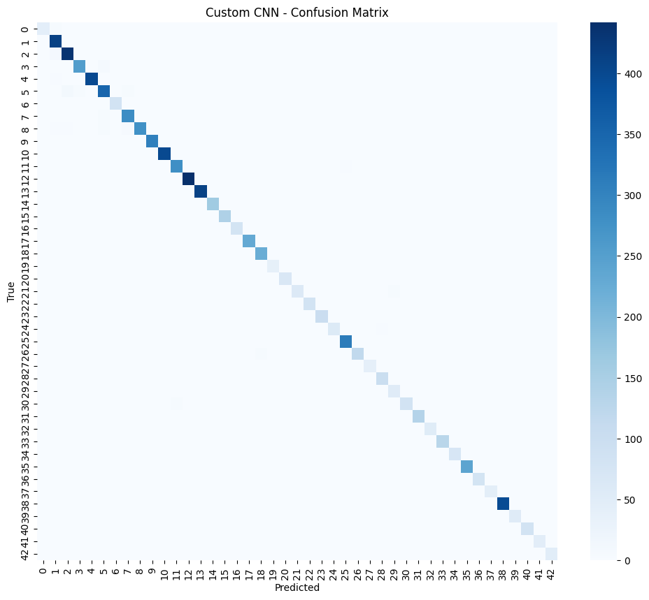
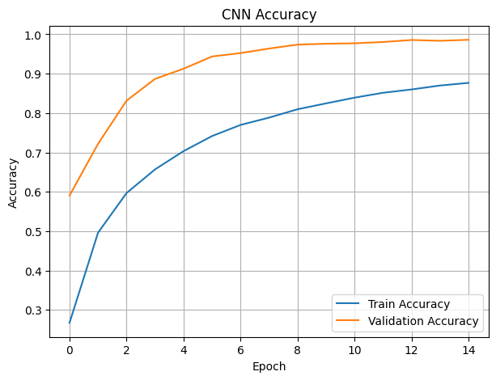
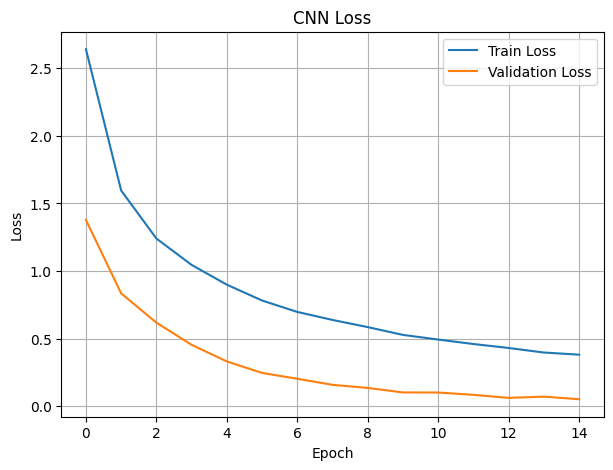
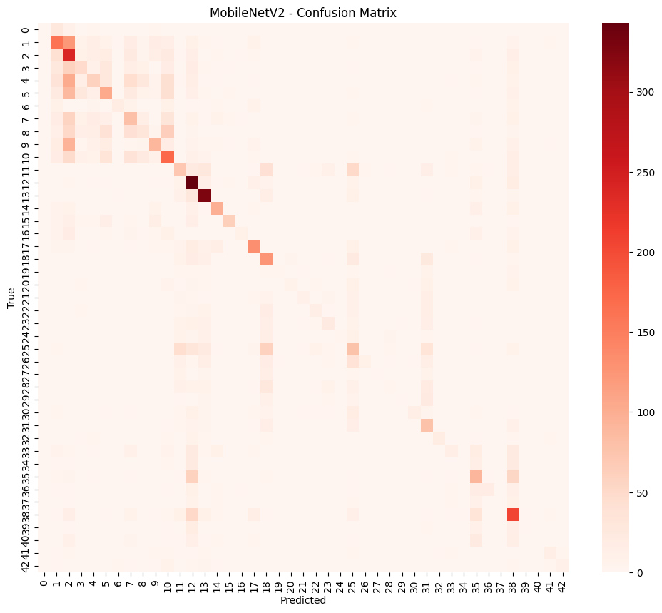
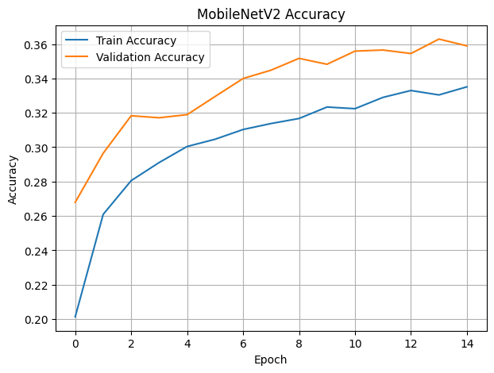
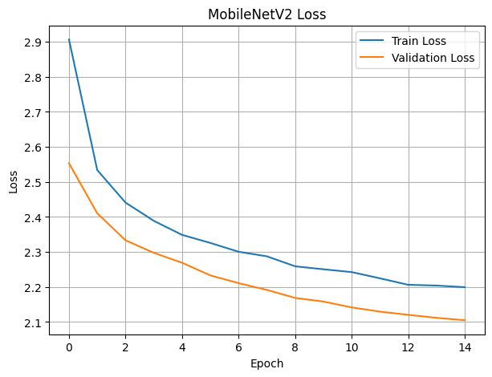

# Traffic Sign Recognition

This project implements a **deep learning pipeline** for classifying traffic signs using both a **Custom Convolutional Neural Network** and a **MobileNetV2 transfer-learning model**.  
It covers all stages of dataset preparation, augmentation, model training, evaluation, visualization, and comparison between architectures.

---

## Overview

The objective of this project is to:

- Load and preprocess the **GTSRB (German Traffic Sign Recognition Benchmark)** dataset.
- Build and train a **custom CNN model** from scratch.
- Train a second model using **MobileNetV2** with frozen feature-extractor layers.
- Evaluate both models using:
  - Accuracy
  - F1-score
  - Classification report
  - Confusion matrix heatmaps
- Compare performance between the two approaches.
- Export the trained weights for deployment.

---

## Features

- Complete preprocessing pipeline for image classification.
- Data augmentation using **ImageDataGenerator**.
- Custom CNN architecture tailored for 32×32 images.
- MobileNetV2 implementation with transfer learning.
- Automated training visualization (accuracy/loss curves).
- Confusion-matrix plotting for both models.
- Exporting trained models as `.h5` files.

---

## Technologies Used

- **Python 3.9+**
- **TensorFlow / Keras**
- **NumPy**
- **OpenCV**
- **Scikit-learn**
- **Matplotlib**
- **Seaborn**

---

## Project Structure

```
Traffic-Sign-Recognition/
│
├── Traffic_Sign_Recognition.ipynb
├── traffic_sign_model.h5
├── traffic_sign_mobilenetv2.h5
├── Result/
└── README.md
```

---

## How to Run

1. Clone the repository:
   ```bash
   git clone https://github.com/Mohammad-Jaafar/Traffic-Sign-Recognition.git
   ```
2. Open the notebook using Jupyter Notebook or Google Colab.
3. Run all cells in order to reproduce the entire workflow.
4. Ensure the **GTSRB dataset** is placed under:
   ```
   GTSRB/Train/
   ```

---

## Results & Evaluation

### Custom CNN Model

**Accuracy:**  
`0.9843`

**F1-Score:**  
`0.9843`

## Classification Report

```
              precision    recall  f1-score   support

           0       1.00      0.98      0.99        41
           1       0.99      0.98      0.99       468
           2       0.98      0.98      0.98       442
           3       0.97      0.96      0.96       292
           4       0.99      1.00      0.99       411
           5       0.94      0.96      0.95       385
           6       1.00      1.00      1.00        82
           7       0.99      0.90      0.94       276
           8       0.89      0.99      0.94       284
           9       0.99      1.00      1.00       274
          10       1.00      0.99      1.00       405
          11       0.99      1.00      0.99       251
          12       1.00      1.00      1.00       388
          13       1.00      1.00      1.00       440
          14       1.00      1.00      1.00       164
          15       1.00      1.00      1.00       137
          16       1.00      1.00      1.00        84
          17       1.00      1.00      1.00       212
          18       1.00      0.97      0.98       258
          19       1.00      0.92      0.96        39
          20       0.96      0.99      0.98        80
          21       1.00      0.95      0.97        74
          22       0.97      1.00      0.99        78
          23       1.00      0.99      0.99        96
          24       0.98      1.00      0.99        48
          25       0.98      1.00      0.99       299
          26       0.96      0.99      0.98       122
          27       0.96      0.98      0.97        56
          28       1.00      0.99      1.00       101
          29       0.98      0.96      0.97        57
          30       1.00      0.96      0.98        98
          31       0.98      1.00      0.99       160
          32       1.00      0.94      0.97        50
          33       0.97      1.00      0.99       134
          34       1.00      1.00      1.00        77
          35       1.00      1.00      1.00       222
          36       1.00      0.95      0.97        82
          37       1.00      1.00      1.00        37
          38       0.99      1.00      1.00       433
          39       1.00      0.94      0.97        50
          40       1.00      1.00      1.00        63
          41       0.98      0.98      0.98        50
          42       0.95      0.98      0.96        42
```

### Confusion Matrix :

------------------------------------------------------------------------



------------------------------------------------------------------------

### Accuracy Curve :

------------------------------------------------------------------------



------------------------------------------------------------------------

### Loss Curve :

------------------------------------------------------------------------



------------------------------------------------------------------------

---

### MobileNetV2 Model

**Accuracy:**  
`0.3625`

**F1-Score:**  
`0.3398`

## Classification Report

```
              precision    recall  f1-score   support

           0       0.33      0.02      0.05        41
           1       0.35      0.43      0.38       468
           2       0.26      0.40      0.32       442
           3       0.34      0.18      0.24       292
           4       0.26      0.28      0.27       411
           5       0.27      0.28      0.27       385
           6       0.63      0.32      0.42        82
           7       0.24      0.20      0.22       276
           8       0.22      0.14      0.17       284
           9       0.43      0.35      0.39       274
          10       0.34      0.41      0.37       405
          11       0.26      0.31      0.28       251
          12       0.37      0.77      0.50       388
          13       0.56      0.78      0.65       440
          14       0.44      0.62      0.51       164
          15       0.74      0.43      0.54       137
          16       0.50      0.20      0.29        84
          17       0.57      0.56      0.56       212
          18       0.38      0.50      0.43       258
          19       0.40      0.05      0.09        39
          20       0.32      0.09      0.14        80
          21       0.25      0.14      0.18        74
          22       0.54      0.24      0.34        78
          23       0.36      0.20      0.26        96
          24       1.00      0.08      0.15        48
          25       0.23      0.22      0.23       299
          26       0.41      0.20      0.27       122
          27       0.00      0.00      0.00        56
          28       0.14      0.02      0.03       101
          29       0.20      0.07      0.10        57
          30       0.52      0.16      0.25        98
          31       0.34      0.61      0.44       160
          32       0.75      0.42      0.54        50
          33       0.41      0.13      0.20       134
          34       0.67      0.05      0.10        77
          35       0.32      0.38      0.35       222
          36       0.69      0.22      0.33        82
          37       0.33      0.03      0.05        37
          38       0.43      0.50      0.46       433
          39       1.00      0.02      0.04        50
          40       0.50      0.03      0.06        63
          41       0.43      0.20      0.27        50
          42       0.50      0.33      0.40        42
```

### Confusion Matrix :

------------------------------------------------------------------------



------------------------------------------------------------------------

### Accuracy Curve :

------------------------------------------------------------------------



------------------------------------------------------------------------

### Loss Curve :

------------------------------------------------------------------------



------------------------------------------------------------------------

---

## Final Comparison

| Model        | Accuracy | F1-Score |
|--------------|----------|----------|
| Custom CNN   | 0.9843   | 0.9843   |
| MobileNetV2  | 0.3625   | 0.3398   |

---

## Conclusion :

The results demonstrate that the Custom CNN model significantly outperformed the MobileNetV2 model in both overall accuracy and F1-score. This difference in performance is largely due to the fact that the Custom CNN was designed and optimized specifically for the traffic-sign dataset, allowing it to learn fine-grained visual patterns more effectively. Training the model from scratch, adjusting the number of layers, and selecting filter sizes tailored to the dataset all contributed to stronger feature extraction and better generalization across all classes.

On the other hand, MobileNetV2 delivered noticeably lower performance. Although it is a powerful lightweight architecture, its pretrained structure is not originally designed for detailed traffic-sign recognition. The variability in scale, color, and symbol shapes across classes requires deeper, more specialized feature learning than what MobileNetV2 provides in its default configuration. Additionally, MobileNetV2 struggled with classes that have subtle visual differences, resulting in lower recall and F1-scores for many categories.

Overall, the experiment confirms that a task-specific CNN, even if smaller in size, can outperform a generic pretrained model when the dataset has unique characteristics that require specialized convolutional features.

---

## Demo on HuggingFace Spaces
- **Traffic Sign Recognition**  
[HuggingFace](https://huggingface.co/spaces/Mhdjaafar/Traffic-Sign-Recognition)

---

## Author

**Mohammad Jaafar**  
mhdjaafar24@gmail.com  
[LinkedIn](https://www.linkedin.com/in/mohammad-jaafar-)  
[HuggingFace](https://huggingface.co/Mhdjaafar)  
[GitHub](https://github.com/Mohammad-Jaafar)

---

*If this project was helpful, feel free to give it a star on GitHub.*
